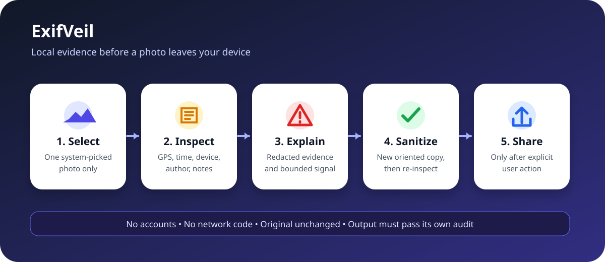

# ExifVeil

> Inspect the metadata a photo carries, then create a separate sanitized copy on iPhone or iPad.



ExifVeil is a native SwiftUI utility for people who want evidence before sharing a photo. It reads known location, capture-time, device, author, and note fields on device, explains why they may matter, and re-encodes a new copy without the source metadata dictionary. The selected original is never changed.

## Why it is useful

- **Visible evidence:** Findings name the category, sensitivity, value, and privacy implication. Exact GPS values are deliberately hidden in the interface.
- **Privacy-preserving input:** `PhotosPicker` gives the app only the item the user selects. ExifVeil does not request broad Photos-library authorization.
- **Verified output:** The sanitizer re-inspects its own output and blocks sharing if a known sensitive finding remains.
- **Non-destructive:** The original stays untouched. Sharing is a separate, explicit action for the newly created temporary file.
- **No service dependency:** There are no accounts, network calls, analytics SDKs, ads, or trained models.

## What the app checks

| Category | Examples | Signal weight |
|---|---|---:|
| Location | GPS latitude, longitude, altitude, destination fields | High |
| Capture time | EXIF original/digitized time and creation-date fields | Medium |
| Device | Camera make/model/software and device or lens serial fields | Medium to high |
| Authorship | Artist, copyright, creator, credit, and contact fields | Medium to high |
| Embedded notes | User comments, captions, descriptions, and keywords | Review |

The bounded `0...100` signal is an explainable triage aid, not a security score. A clean report means ExifVeil found none of the keys in its documented classifier. It does not prove anonymity.

## Sanitization pipeline

1. Decode one still-image frame with ImageIO.
2. Read and classify its metadata leaf values.
3. Apply the EXIF orientation to the decoded pixels with Core Image.
4. Write a new JPEG or PNG without copying source metadata.
5. Inspect the output again and require zero known sensitive findings.
6. Offer the validated temporary file to the system share sheet.

JPEG input is re-encoded at quality `0.92`, so compressed bytes and file size can change. PNG stays PNG. Other still-image formats are written as JPEG in version 1.0. Animated and multi-frame images are rejected instead of silently dropping frames.

## Build and run

Requirements:

- macOS with Xcode 16 or later
- iOS 17 simulator or device
- [XcodeGen](https://github.com/yonaskolb/XcodeGen)

```bash
brew install xcodegen
xcodegen generate
open ExifVeil.xcodeproj
```

Select the `ExifVeil` scheme and run it on an iPhone or iPad simulator. No signing team is needed for simulator builds. Device installation requires your normal Apple development signing setup.

## Verification

The test fixture is generated entirely in memory. It is a 2 by 3 pixel JPEG containing synthetic GPS coordinates, a timestamp, camera make/model, author, and comment. Tests verify classification, GPS redaction, bounded scoring, malformed input rejection, metadata removal, and orientation-normalized dimensions.

```bash
swift test
brew install xcodegen
xcodegen generate
xcodebuild \
  -project ExifVeil.xcodeproj \
  -scheme ExifVeil \
  -sdk iphonesimulator \
  -destination 'platform=iOS Simulator,name=iPhone 16 Pro,OS=latest' \
  test CODE_SIGNING_ALLOWED=NO
```

Windows can run the repository and privacy-boundary check:

```powershell
node tests/static-check.mjs
```

Actual dated evidence is recorded in [the verification log](docs/experiments/2026-09-14-verification.md). Hosted CI is the native Swift/Xcode verification environment because the project was authored from a Windows host without Swift or Xcode.

## Repository map

```text
App/                         SwiftUI picker, report, sanitize, and share UI
Sources/ExifVeilCore/        metadata classifier, report model, sanitizer
Tests/ExifVeilCoreTests/     generated-fixture XCTest suite
docs/                        spec, decisions, evidence, and limitations
Package.swift                macOS Swift Package verification for the core
project.yml                  reproducible iOS Xcode project definition
```

## Privacy and safety boundary

ExifVeil processes the selected bytes locally and contains no network API usage. It does not save results to Photos automatically, delete metadata from the original, inspect visible pixel content, remove steganographic payloads, rename source files, or control what a receiving service records. Temporary exports remain subject to normal iOS lifecycle behavior.

## Limitations

- Version 1.0 handles one still-image frame, not video, Live Photos, RAW workflows, or animated images.
- The known-key classifier cannot promise coverage of every vendor-specific metadata namespace.
- Re-encoding may change compression, color handling, file size, and pixel values for lossy input.
- Exact GPS values are hidden in the UI, but the selected source bytes still exist in app memory while the workflow is active.
- No Windows-native Swift compile is claimed. Native behavior is checked by hosted macOS and iOS Simulator CI.
- No physical-device, VoiceOver session, broad codec corpus, or adversarial metadata audit is included yet.

## Best next improvement

Add a documented codec corpus covering HEIC, wide-gamut JPEG, PNG color profiles, vendor EXIF namespaces, and malformed metadata, then report preservation and removal results per codec without broadening into batch Photos-library access.

## License

MIT. The synthetic test image is generated by the test suite and contains no third-party data or assets.

